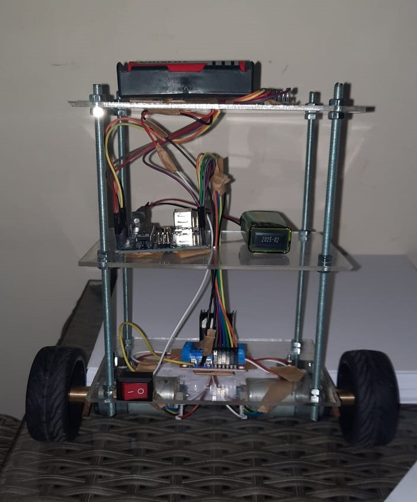

# Self-Balancing Robot

This project showcases a Self-Balancing Robot that uses a PID control algorithm and an MPU6050 IMU sensor to maintain balance on two wheels. The robot continuously adjusts its motor speeds to stay upright, mimicking the behavior of a Segway.

## Features

- **PID Control**: A PID algorithm stabilizes the robot’s tilt.
- **IMU Sensor**: Measures the tilt angle using an MPU6050 accelerometer and gyroscope.
- **Arduino-Based**: An Arduino Uno controls the motor speeds based on sensor data.

## How it Works

The robot balances itself by adjusting motor speeds based on the tilt data from the MPU6050 sensor. The system operates in real-time, constantly compensating for any changes in angle to keep the robot upright.

## PID Tuning

The PID constants (Kp, Ki, Kd) are adjustable, allowing you to fine-tune the robot's performance. You can experiment with these values to improve stability, especially when working with different chassis designs or weights.

## Visuals

### Robot Image

### Closed-Loop System Diagram

## License

This project is licensed under the MIT License.
